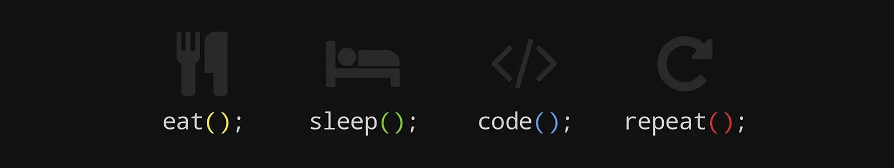
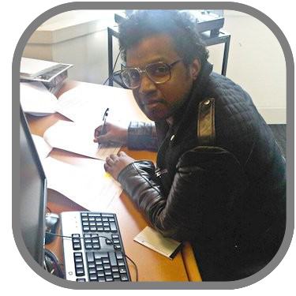

**Note:** Trying to be more healthy nowadays so insert Gym somewhere there and the banner's about right!

<h2 align="center">Gabriel Desir</h2>

Hi, I'm **Gabe**! An enthusiastic life-long **software/electronics** hobbyist who is eager to upskill and contribute to a team on worldclass projects!

## Spotlight
- <a href="https://bit.ly/3GrIWOX" target="_blank">**Bookstore Management System**</a>:　Built a bookstore management system that allows a clerk to manage the store's inventory by adding, updating, deleting, and searching for books in the database.

## Experience

- Technical Sound Designer @Trasnatech on AccuRC Simulator Project (March 2012 - April 2018)
- Audio Engineer @Searchmetrics (June 2018 - Jul 2021)
- Music Composer/Audio Engineer @Warner/Chappell Music (March 2012 - March 2015)

## Education

- Software Engineering Bootcamp at HyperionDev (December 2022 – April 2023)
- Bachelor's in Psychology (Like Mark Zuckerberg!) @Brunel University (September 2005 – May 2008)

## Links

<a href="mailto:contact@mgdesir.com"> Email me!</a>

<a href="https://github.com/DocDooom" target="_blank"> github.com/DocDooom</a>

<a href="https://www.linkedin.com/in/gabriel-desir/" target="_blank"> LinkedIn</a>

